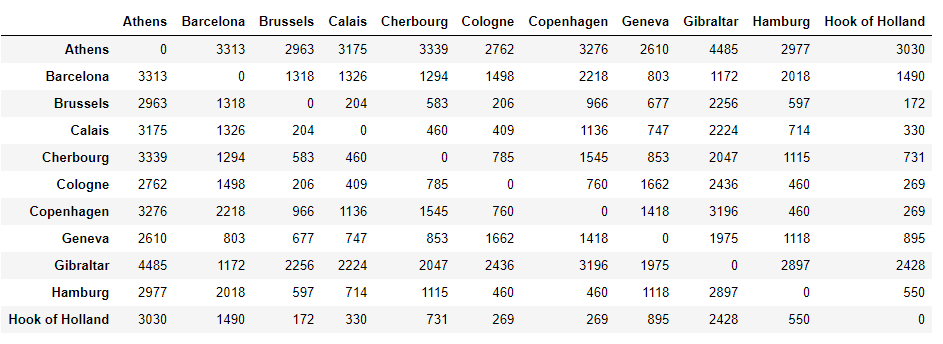
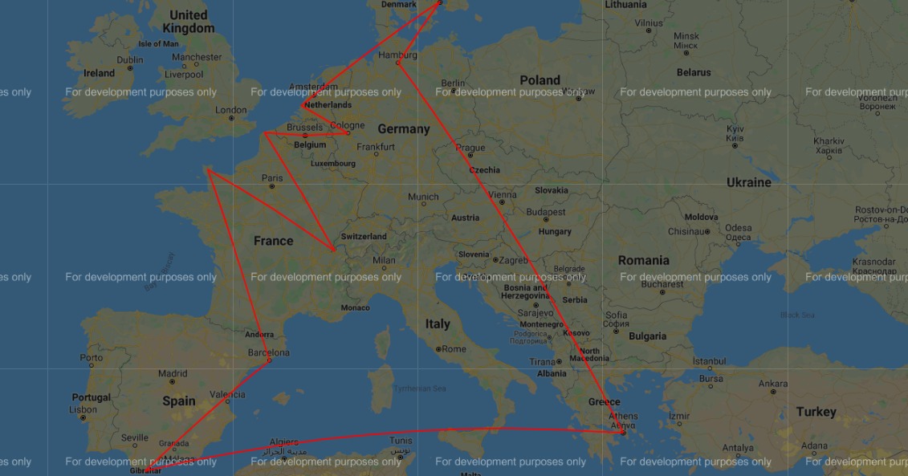

# Genetic-Algorithm-EuropeanCities
Genetic Algorithm to solve TSP
 * You are planning to visit a few places in Europe, In the interest of time you have narrowed them down to 10 places, you start from Athens  visit 10 places and come back to Athens.
We have generated a matrix with 10 places and the distances.
* The goal is to cover all the places by travelling as little as possible, you decide to find the smallest distance possible using ‘Genetic Algorithm’.

* The distance matrix for the problem can be as follows:

* The best possible solution we got was:

